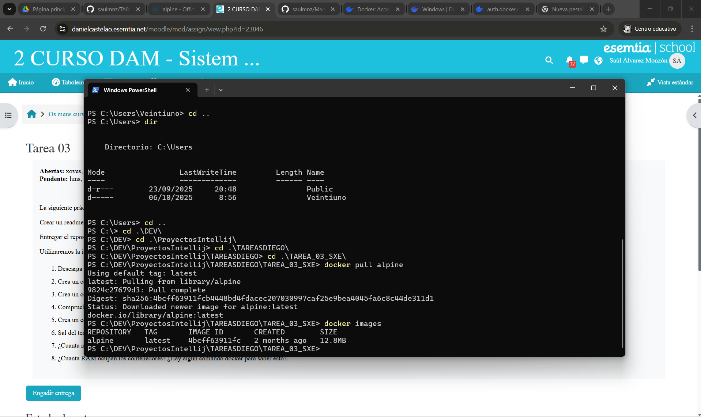
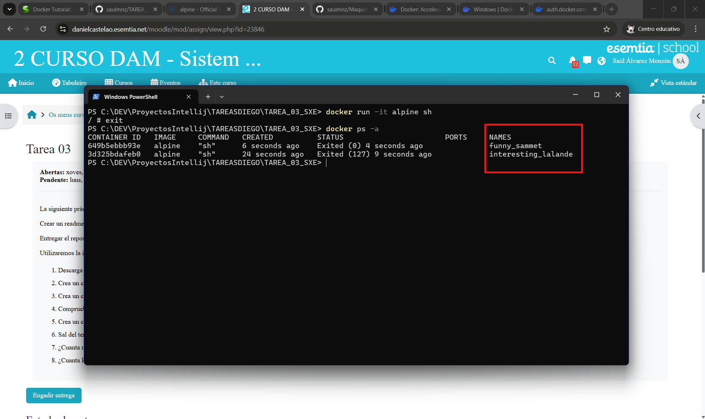
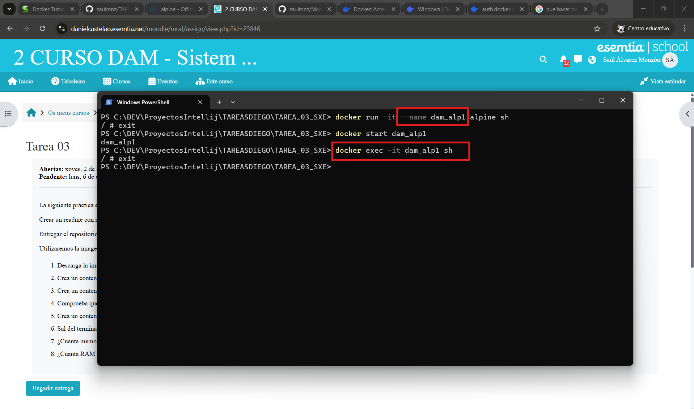
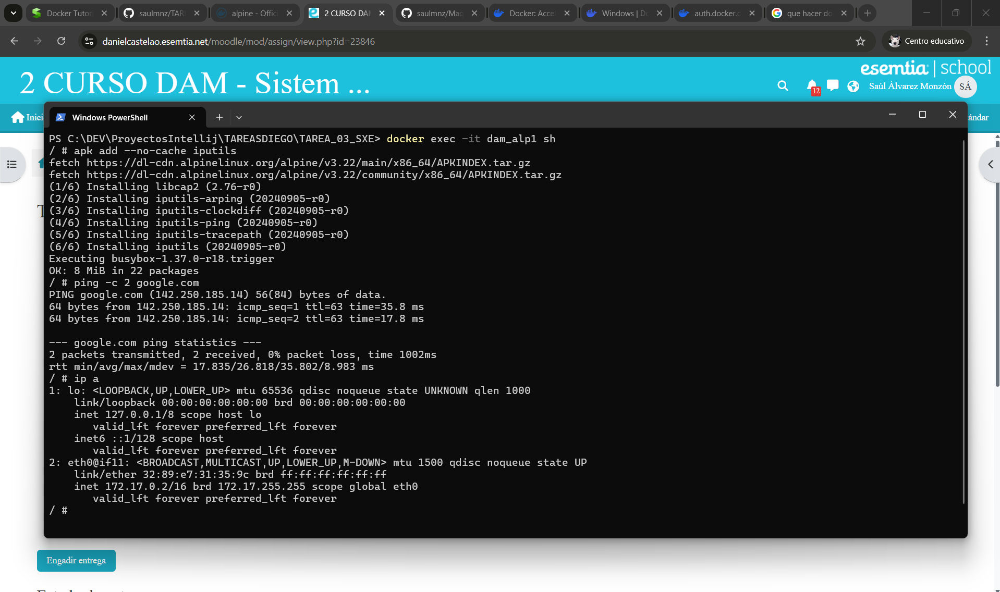
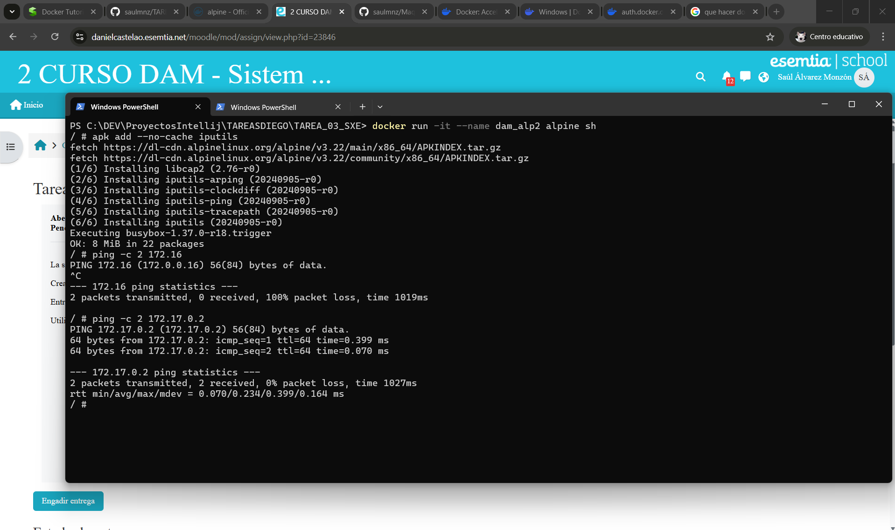
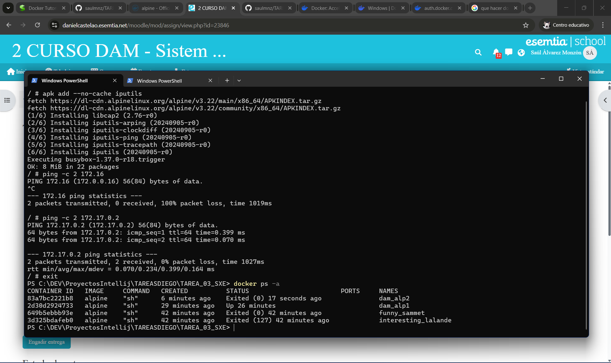
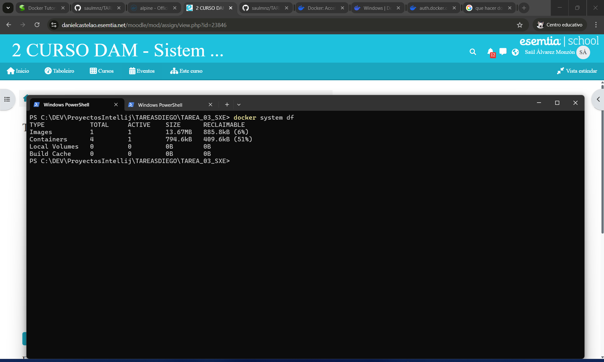
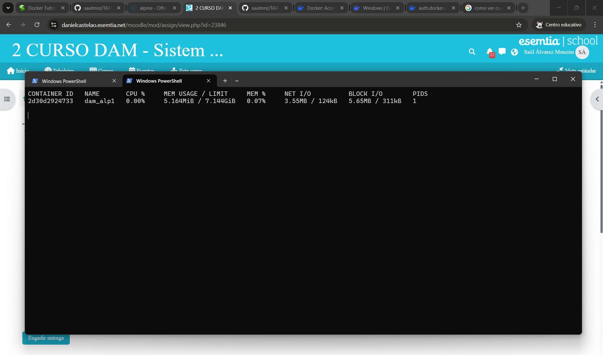

# PRÁCTICA DOCKER 🐳: 
  

## 1 - DESCARGAR IMAGEN ALPINE Y COMPROBAR QUE ESTÁ EN EL EQUIPO ⚡

- **Consultamos la página oficial de docker para comprobar como es la instalación de la imagen alpine, con el comando docker pull alpine la imagen quedará
instalada y con docker images comprobaremos que esto sea verídico**

 

---

## 2 - DESCARGAR CONTENEDOR SIN NOMBRE 🖥️

- **El contenedor está arrancado mientras el usuario esté dentro de el, al salir el contenedor se detiene, en la captura se aprecia como
iniciamos una instancia en la terminal y ejecutamos el shell como proceso principal, docker creará el contenedor iniciandolo sin problema por lo tanto,
sí, está arrancado...**

 

---

## 3 - CREAR CONTENEDOR NOMBRE 'dam_alp1' ACCESO A ESTE 💾

- **Creamos el contenedor dam_alp1, una vez creado, comprobamos que podemos acceder a el en cualquier momento.**

 

---

## 4 - COMPROBAR IP Y PING A GOOGLE.COM 📦

- **Para realizar este apartado deberemos instalar las ip utils ya que no las incluye la imagen por defecto, así podremos 
ejecutar los comandos IP nesarios, una vez instalado el paquete comprobamos la conexión con google y mostramos la ip del contenedor.**

 

---
 
## 5 - CONTENEDOR NOMBRE 'dam_alp2' PING ENTRE CONTENEDORES 🖧

- **En este apartado deberemos de realizar los comandos usados anteriormente, primero crearemos el contenedor 
con el nombre deseado, instalamos las ip utils y utilizamos el comando ping hacia la ip que se muestra en el apartado anterior
( ip del contenedor alpine 1 )  comprobando así la conectividad entre contenedores.**

 

---

## 6 - SALIR DEL TERMINAL ⛔

- **Al salir del contenedor este se detiene pero no se elimina, se puede comprobar el estado de los contenedores con el comando que se muestra en la imagen.**

 

---

## 7 - MEMORIA EN DISCO QUE SE OCUPÓ 📊

- **Para comprobar la memoria en disco deberemos de ejecutar el siguiente comando :**

 

---
## 8 - CUÁNTA RAM OCUPAN LOS CONTENEDORES, COMANDO 📊

- **El comando para saber cuanta RAM ocupa un contenedor es; - docker stats 'nombre_contenedor' - **

 

---

